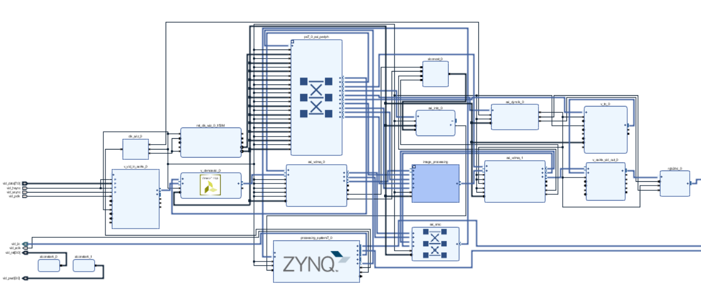
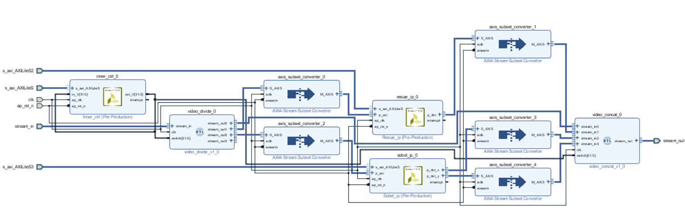

# Zynq-7000-Video-Overlay

## 系统简介
该系统实现了Zynq-7000系列FPGA的摄像头输入、HDMI输出通路，并使用HLS编写处理IP，对输入的720p、30
fps视频进行实时的处理显示。

## 软件需求
* Vivado&reg; Design Suite 2018.2

* Board files for PYNQ-Z2

* Xilinx SDK 2018.2

## 硬件需求

* PYNQ-Z2开发板

* MicroUSB数据线

* 0V5640摄像头

* PMOD转接板

* HDMI线

* HDMI显示屏

## 系统设计

### 视频系统通路
该通路采用 OV5640 摄像头输入，将 DVP 信号转为 AXI Stream 信号送入 VDMA，之
后通过 VDMA 将帧缓存送入 HLS 编写的处理 IP 进行处理后再存入 VDMA，并将帧缓存
转为 HDMI 信号输出显示，其中裸机程序在 SDK 中编写。

### 图像处理模块
使用HLS及xfOpenCV编写图像处理IP，添加到输入和输出VMDA之间，对Axi Stream协议的数据进行处理。该系统添加了原图、Resize、Sobel-X和Sobel-Y四个数据通路，可以在SDK中编写程序进行切换。

## 使用指南
1. 在 *prebuilt* 提供制作好的 *BOOT.bin* 的启动文件，配置好硬件之后，将 *BOOT.bin* 拷贝至SD卡中即可运行。
2. 也可以使用 *Vivado 2018.2* 打开工程，生成bitstream，在SDK中运行程序。

## 运行效果
运行效果可以参考*result.mp4*。

## 参考资料
1. [PYNQ-Z2 Base Overlay](https://pynq.readthedocs.io/en/latest/pynq_overlays/pynqz2/pynqz2_base_overlay.html)

2. [cv2pynq](https://github.com/wbrueckner/cv2pynq)

## TODO